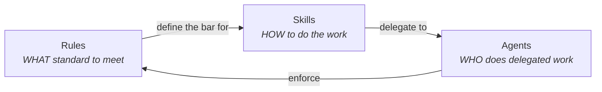
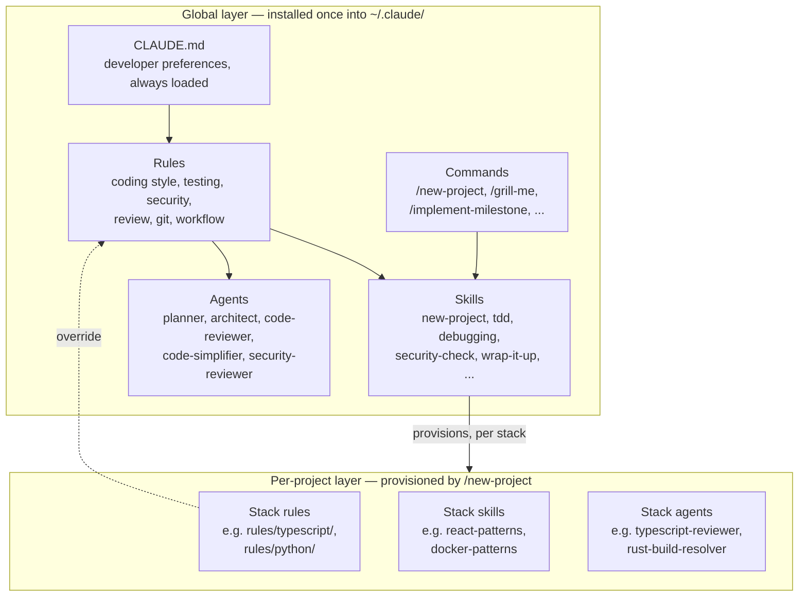
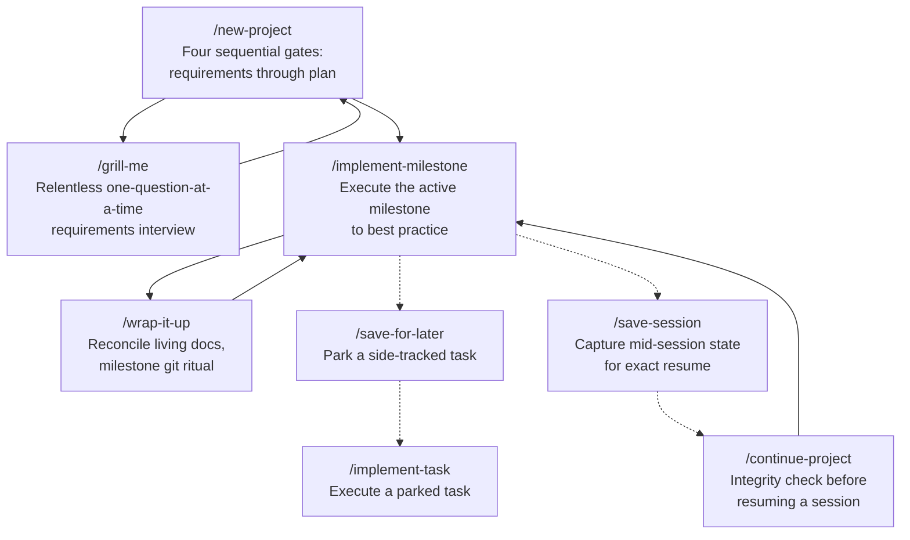
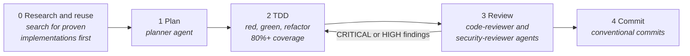
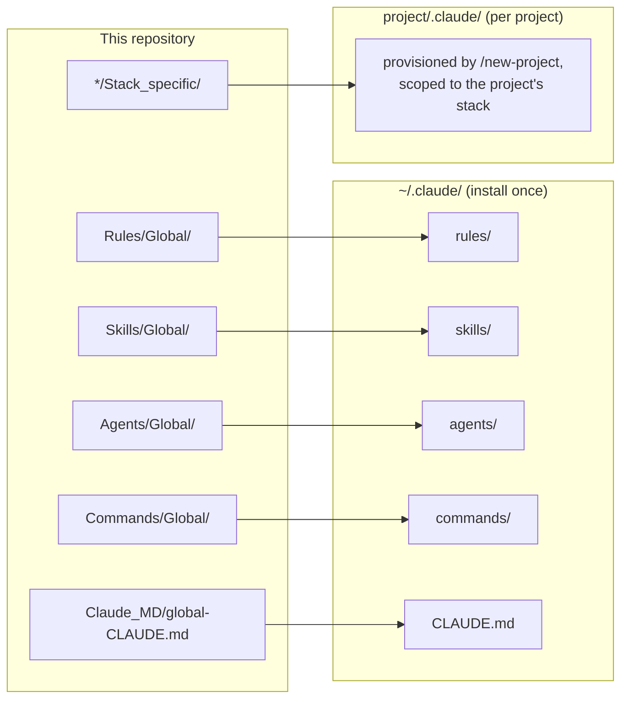

# Lindholm Code

**A complete configuration framework for [Claude Code](https://claude.com/claude-code): the rules, skills, and agents that turn a general-purpose coding assistant into a disciplined engineering partner.**

Claude Code is powerful out of the box, but unopinionated. This framework gives it opinions — a coherent, professional software development methodology covering planning, test-driven development, code review, security, and git workflow, plus deep per-language expertise for 20+ languages and frameworks.

Everything here is self-contained and copy-friendly: install the global layer once, and provision language-specific artifacts per project as you need them.

---

## Contents

- [The core idea](#the-core-idea)
- [What is in the box](#what-is-in-the-box)
- [How the pieces work together](#how-the-pieces-work-together)
- [The project lifecycle](#the-project-lifecycle)
- [The development pipeline](#the-development-pipeline)
- [Language coverage](#language-coverage)
- [Installation](#installation)
- [Repository layout](#repository-layout)
- [Extending the framework](#extending-the-framework)

---

## The core idea

The framework is built on one distinction, applied everywhere:

| Artifact | Answers | Example |
|----------|---------|---------|
| **Rule** | *WHAT* standard must be met | "Test coverage must be at least 80%" |
| **Skill** | *HOW* to do the work | The step-by-step TDD workflow that gets you there |
| **Agent** | *WHO* does delegated work in a separate context | The code reviewer that checks the result |



Every artifact in this repository fits exactly one of these three categories. If a proposed addition does not, it does not belong.

A second distinction governs *where* things are installed:

- **Global** artifacts apply to every project and are installed once into `~/.claude/`.
- **Stack-specific** artifacts are provisioned per project, matched to that project's languages, frameworks, and infrastructure choices.

## What is in the box

| Layer | Global | Stack-specific |
|-------|--------|----------------|
| **Rules** | 10 rule files: coding style, testing, code review, security, git workflow, development workflow, agent orchestration, patterns, performance, hooks | Per-language rule sets for 21 stacks (TypeScript, Python, Go, Rust, Swift, Kotlin, and more), plus shared web design rules |
| **Skills** | 17 skills: the project lifecycle (`new-project`, `implement-milestone`, `wrap-it-up`, ...), TDD, systematic debugging, security auditing, requirements interviewing, and more | 34 skills: language patterns and testing guides, framework deep-dives, and infrastructure skills (Docker, Postgres, Redis, deployment) |
| **Agents** | 5 agents: planner, architect, code-reviewer, code-simplifier, security-reviewer | 25 agents: per-language reviewers and build-resolvers |
| **Commands** | 13 slash commands — the user-facing entry points to the lifecycle skills | — |
| **CLAUDE.md** | The shipped global developer-preferences file that wires it all together | — |

## How the pieces work together

The global `CLAUDE.md` is the always-loaded baseline. It states the operating principles and points to the rules; the rules point to the skills and agents that satisfy them. Stack-specific artifacts are attached to a project when its stack calls for them.



**Precedence** when guidance conflicts: user instructions override the project `CLAUDE.md`, which overrides the global layer. Stack-specific rules override global rules.

## The project lifecycle

The lifecycle skills carry a project from vague idea to shipped milestones, with explicit user-confirmed gates so nothing is built on an unvalidated assumption.



- **`/new-project`** walks four gates — requirements, architecture, design, plan — each confirmed by the user before the next opens. It calls `/grill-me` to interview until intent is concrete, then provisions the project's stack-specific artifacts.
- **`/implement-milestone`** executes one milestone through the full development pipeline (below), stopping at the commit gate.
- **`/wrap-it-up`** closes a milestone: reconciles the living docs (`PRD.md`, plans) with what actually shipped, then performs the git ritual.
- **`/save-session`** and **`/continue-project`** make work resumable across sessions — state lives in files, not conversation memory.

## The development pipeline

Every feature moves through the same pipeline, defined in the rules and executed by the skills and agents:



Key behaviors this enforces:

- **Research before writing.** Search for existing implementations and battle-tested libraries before writing net-new code.
- **Tests first, always.** The `tdd` skill enforces write-the-failing-test-first; the `systematic-debugging` skill forbids patching symptoms before the root cause is found.
- **Review is not optional.** Milestone code is always reviewed; security-sensitive code triggers the security reviewer. Findings are verified against the codebase before being implemented — the framework explicitly bans performative agreement with reviewers.
- **Evidence before claims.** Nothing is declared "done", "passing", or "fixed" until the proving command has been run fresh and its output read.
- **A sparring partner, not a yes-man.** The global preferences instruct Claude to challenge weak assumptions and push back with technical reasoning, prioritizing truth over agreement.

## Language coverage

Full support for a language means five artifacts: stack rules, a patterns skill, a testing skill, a reviewer agent, and a build-resolver agent.

| Tier | Languages / stacks |
|------|--------------------|
| **Full** | React, Django, Go, Rust, Kotlin, Swift |
| **Partial** | Python, FastAPI, TypeScript, C++, C#, F#, Dart/Flutter, Java, PHP, Perl, Angular, Vue, Nuxt |
| **Minimal** | Ruby, HarmonyOS/ArkTS |

Gaps are deliberate, not accidental — the policy is **build on demand, not on spec**. A missing artifact is added when a real project proves the generic coverage insufficient, never speculatively. `COVERAGE.md` is the source of truth for the full matrix and the reasoning behind every gap.

Infrastructure skills (`docker-patterns`, `postgres-patterns`, `redis-patterns`, `deployment-patterns`, `database-migrations`, `e2e-testing`) are language-agnostic and attach to a project by its tooling choices.

## Installation

The `Global/` and `Stack_specific/` folder names are authoring markers — they record where an artifact is installed and are not kept at the destination.



**Global layer** — copy once into `~/.claude/` (on Windows: `C:\Users\<you>\.claude\`):

1. Each `Rules/Global/<topic>.md` to `~/.claude/rules/<topic>.md`.
2. Each `Skills/Global/<name>/` folder **in full** to `~/.claude/skills/<name>/` — skills ship disclosed reference files that must travel with them.
3. Each `Agents/Global/<name>.md` to `~/.claude/agents/<name>.md`.
4. Each `Commands/Global/<name>.md` to `~/.claude/commands/<name>.md`.
5. `Claude_MD/global-CLAUDE.md` to `~/.claude/CLAUDE.md`.

Back up your existing `~/.claude/` first — installation overwrites by name.

**Stack-specific layer** — never installed globally. Run `/new-project` in a new project and it provisions the artifacts matching your chosen stack into the project's `.claude/` directory.

The full step-by-step checklist, including verification steps, lives in `MIGRATION.md`.

## Repository layout

```
.
|-- CLAUDE.md            Governing document: purpose and build conventions
|-- COVERAGE.md          Language support matrix and gap policy
|-- MIGRATION.md         Step-by-step installation checklist
|-- Agents/
|   |-- Global/          planner, architect, code-reviewer, code-simplifier, security-reviewer
|   \-- Stack_specific/  per-language reviewers and build-resolvers
|-- Skills/
|   |-- Global/          lifecycle, TDD, debugging, security, meta-skills
|   \-- Stack_specific/  language patterns, testing guides, infrastructure skills
|-- Rules/
|   |-- Global/          the standards every project must meet
|   \-- Stack_specific/  per-language rules that extend or override Global
|-- Commands/
|   \-- Global/          slash-command wrappers for user-invoked skills
\-- Claude_MD/
    \-- global-CLAUDE.md the shipped global developer-preferences file
```

## Extending the framework

The framework maintains itself with its own tools:

- **`/create-skill`** is the meta-skill for adding a new skill. It forces a justification first: the skill must recur across projects, change how Claude behaves, and cover ground nothing else here covers. Thin skills that restate existing rules are rejected as bloat.
- **Naming is contractual.** Stack-specific skills follow four naming patterns (`<language>-patterns`, `<language>-testing`, `<tool>-patterns`, `<framework>-developer`); a name outside them is a defect.
- **References must resolve.** Every cross-reference between artifacts must point to something that exists in this repository. Broken references are defects to fix on sight.
- **Curation over accumulation.** Adopted material is kept at full fidelity, but nothing is added without justification, and one valuable rule folded into an existing artifact beats a thin new file.

The conventions in full — frontmatter schemas, body structure, the definition of done — live in this repository's `CLAUDE.md`.

---

*English only, no emojis, explicit over clever — the framework practices what it preaches.*
